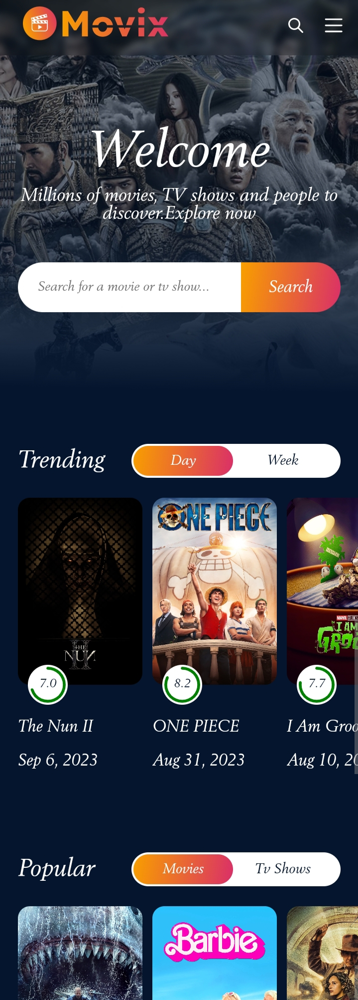

<h1 align="center" id="title">Movix_App</h1>

<p id="description">This is a movie listing app made using TMDB api.</p>

<h2>🚀 Demo</h2>

[https://movixzilla.netlify.app/](https://movixzilla.netlify.app/)

<h2>Project Screenshots:</h2>




<h2>🛠️ Installation Steps:</h2>

<p>1. Clone the repo</p>

```
https://github.com/mukeshpandey9/Movix_App.git
```

<p>2. Install all the node modules</p>

```
npm install
```

<p>3. Run the server</p>

```
npm run dev
```

<p>4. That's it web app live on</p>

```
localhost:5137
```

<h2> Technologies Used:- </h2>
<p>1. React</p>
<p>2. Redux </p>
<p>3. TMDB Api </p>
<p>4. Sass </p>
<p>5. Axios </p>
<p>6. Lazy loading </p>
